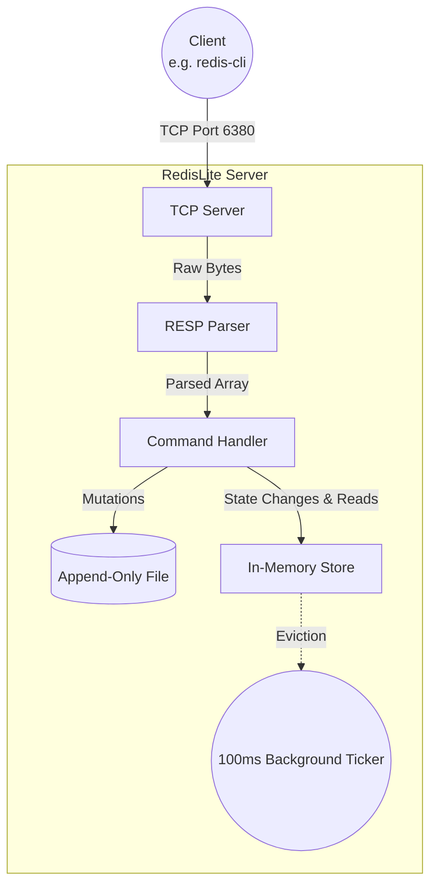

# Architecture

This document outlines the internal architecture of RedisLite. The system is designed to be as simple as possible while maintaining performance and strict Redis protocol compatibility.

## High-Level Flow

## Components

### 1. TCP Server (`server.go`)
Listens on port `6380`. When a client connects, the server spawns a new goroutine specifically for that connection. This allows multiple clients to interact concurrently without blocking the main thread.

### 2. RESP Parser (`parser.go`)
Reads the raw byte stream from the TCP connection. It implements a custom, dependency-free parser for the Redis Serialization Protocol (RESP). It extracts arrays of "bulk strings" which represent commands (e.g., `["SET", "key", "value"]`).

### 3. Command Handler (`server.go`)
A massive switch statement that takes the parsed command, validates the argument count, and routes it to the appropriate method in the in-memory store. If the command mutates state, it triggers a write to the AOF.

### 4. In-Memory Store (`store.go`)
The core data structure. It uses native Go `map`s wrapped in a `sync.RWMutex`. 
- **Read Operations** (like `GET`) take an `RLock()`, allowing many clients to read concurrently.
- **Write Operations** (like `SET`, `DEL`) take a full `Lock()`.
- An independent goroutine wakes up every 100ms to sweep and delete keys that have surpassed their expiration time.

### 5. Append-Only File (AOF) (`aof.go`)
Persistence layer. Every write command that successfully modifies the store is synchronously appended to `redislite.aof` in its raw RESP format. On startup, the server reads this file and pipes the commands back through the Command Handler to perfectly reconstruct the state.
